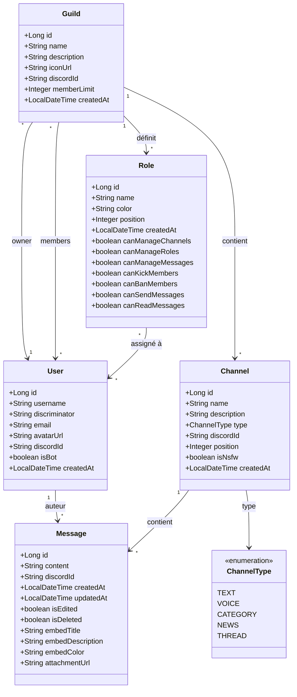

# Diagramme de classes - Modèle de données Discord Bot

## Vue d'ensemble des entités

## Description des relations

### User (Utilisateur)
- **OneToMany** avec Message : Un utilisateur peut créer plusieurs messages
- **ManyToMany** avec Guild : Un utilisateur peut être membre de plusieurs guildes via `guild_members`
- **ManyToMany** avec Role : Un utilisateur peut avoir plusieurs rôles via `user_roles`
- **OneToMany** (inverse) avec Guild : Un utilisateur peut être propriétaire de plusieurs guildes

### Guild (Serveur)
- **ManyToOne** avec User (owner) : Chaque guilde a un propriétaire unique
- **ManyToMany** avec User (members) : Une guilde peut avoir plusieurs membres
- **OneToMany** avec Channel : Une guilde contient plusieurs canaux (cascade ALL)
- **OneToMany** avec Role : Une guilde définit plusieurs rôles (cascade ALL)

### Channel (Canal)
- **ManyToOne** avec Guild : Chaque canal appartient à une guilde
- **OneToMany** avec Message : Un canal contient plusieurs messages (cascade ALL)
- **ManyToOne** avec ChannelType : Chaque canal a un type (TEXT, VOICE, etc.)

### Role (Rôle)
- **ManyToOne** avec Guild : Chaque rôle appartient à une guilde
- **ManyToMany** avec User : Un rôle peut être assigné à plusieurs utilisateurs

### Message
- **ManyToOne** avec User (author) : Chaque message a un auteur
- **ManyToOne** avec Channel : Chaque message appartient à un canal

## Tables de jointure

| Table | Colonnes | Description |
|-------|----------|-------------|
| `guild_members` | `guild_id`, `user_id` | Association ManyToMany entre Guild et User (membres) |
| `user_roles` | `role_id`, `user_id` | Association ManyToMany entre Role et User |

## Contraintes et validations

### User
- `username` : 2-32 caractères, non vide
- `discriminator` : exactement 4 chiffres (pattern `\d{4}`)
- `email` : format email valide, unique
- `discordId` : unique (pour synchronisation avec Discord)

### Guild
- `name` : 2-100 caractères, non vide
- `owner` : obligatoire
- `memberLimit` : entre 2 et 800 000
- `discordId` : unique

### Channel
- `name` : 1-100 caractères, non vide
- `type` : obligatoire (enum ChannelType)
- `guild` : obligatoire
- `position` : >= 0

### Role
- `name` : 1-100 caractères, non vide
- `color` : format hexadécimal `#RRGGBB`
- `guild` : obligatoire
- `position` : >= 0

### Message
- `content` : 1-2000 caractères, non vide
- `author` : obligatoire
- `channel` : obligatoire
- `isDeleted` : suppression logique (le message reste en base)

## Lifecycle Callbacks

Toutes les entités implémentent `@PrePersist` pour initialiser automatiquement `createdAt`.

La classe `Message` implémente également `@PreUpdate` pour mettre à jour `updatedAt` et marquer `isEdited = true`.
